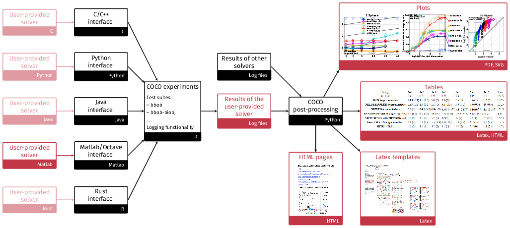

numbbo/coco: Comparing Continuous Optimizers
============================================

> [!IMPORTANT]
>
> This repository contains the source files for the `coco` framework.
> If you don't want to *extend* the framework, you probably don't need this!
> See instead the [new documentation](https://numbbo.it/getting-started) and use the language bindings of your choice from the package repository for your language (e.g. PyPI for Python, crates.io for Rust, ...).

> [!CAUTION]
>
> We are currently refactoring the `coco` code base to make it more accessible.
> Much of the documentation is therefore outdated or in a state of flux.
> We try our best to update it as soon as possible, if you find something that you think is outdated or needs a better description, don't hestitate to open an issue or a pull request!


[](https://doi.org/10.5281/zenodo.2594848)
[[BibTeX](https://zenodo.org/record/2594848/export/hx#.XIu-BxP0nRY)] cite as:
> Nikolaus Hansen, Dimo Brockhoff, Olaf Mersmann, Tea Tusar, Dejan Tusar, Ouassim Ait ElHara, Phillipe R. Sampaio, Asma Atamna, Konstantinos Varelas, Umut Batu, Duc Manh Nguyen, Filip Matzner, Anne Auger. COmparing Continuous Optimizers: numbbo/COCO on Github. Zenodo, [DOI:10.5281/zenodo.2594848](https://doi.org/10.5281/zenodo.2594848), March 2019.
---

[This code](https://github.com/numbbo/coco) provides a platform to
benchmark and compare continuous optimizers, AKA non-linear solvers
for numerical optimization. It is fully written in `ANSI C` and
`Python` (reimplementing the original Comparing Continous
Optimizer platform) with other languages calling the `C` code.
Languages currently available to connect a solver to the benchmarks are

  - `C/C++`
  - `Java`
  - `MATLAB`
  - `Octave`
  - `Python`
  - `Rust`

Contributions to link further languages (including a better
example in `C++`) are more than welcome.

The general project structure is shown in the following figure
where the black color indicates code or data provided by the platform
and the red color indicates either user code or data and graphical output
from using the platform:



For more general information:
- The [GitHub.io documentation pages](https://numbbo.github.io/coco/) for COCO
- The article on benchmarking guidelines and an introduction to [COCO: A Platform for Comparing Continuous Optimizers in a Black-Box Setting (pdf)](https://www.tandfonline.com/eprint/DQPF7YXFJVMTQBH8NKR8/pdf?target=10.1080/10556788.2020.1808977) or at [arXiv](https://arxiv.org/abs/1603.08785)
- The [COCO experimental setup](http://numbbo.github.io/coco-doc/experimental-setup) description
- The [BBOB workshops series](http://numbbo.github.io/workshops)
- For COCO/BBOB news [register here](http://numbbo.github.io/register)
- See [links below](#Links) to learn even more about the ideas behind COCO


# Getting Started <a name="Getting-Started"/>

## Running Experiments

1. For running experiments **in Python after [release 2.6.3](https://github.com/numbbo/coco/releases) (Apr 2023)**, follow the (new) instructions [here](https://numbbo.it/getting-started/experiment-python.html).  
   **Otherwise, download** the COCO framework code from github,

    - either by clicking the [Download ZIP button](https://github.com/numbbo/coco/archive/master.zip) 
      and unzip the `zip` file, 
    - or by typing `git clone https://github.com/numbbo/coco.git`. This way 
      allows to remain up-to-date easily (but needs `git` to be installed). After 
      cloning, `git pull` keeps the code up-to-date with the latest release. 

    The record of official releases can 
    be found [here](https://github.com/numbbo/coco/releases). The latest release corresponds 
    to the [master branch](https://github.com/numbbo/coco/tree/master) as linked above. 

2. In a system shell, **`cd` into** the `coco` or `coco-<version>` folder (framework root), 
    where the file `do.py` can be found. Type, i.e. **execute**, one of the following commands once
    ```sh
      python do.py run-c
      python do.py run-java
      python do.py run-matlab
      python do.py run-octave
      python do.py run-python
    ```  
    depending on which language shall be used to run the experiments. `run-*` will build the 
    respective code and run the example experiment once. The build result and the example
    experiment code can be found under `code-experiments/build/<language>` (`<language>=matlab` 
    for Octave). `python do.py` lists all available commands. 
  
4. **Copy** the folder `code-experiments/build/YOUR-FAVORITE-LANGUAGE` and
    its content to another location. In Python it is sufficient to copy the 
    file [`example_experiment_for_beginners.py`](./code-experiments/build/python/example_experiment_for_beginners.py)
    or [`example_experiment2.py`](./code-experiments/build/python/example_experiment2.py).
    Run the example experiment (it already is compiled). As the details vary, see
    the respective read-me's and/or example experiment files:

    - `C` [read me](./code-experiments/build/c/README.md) 
      and [example experiment](./code-experiments/build/c/example_experiment.c)
    - `Java` [read me](./code-experiments/build/java/README.md)
      and [example experiment](./code-experiments/build/java/ExampleExperiment.java)
    - `Matlab/Octave` [read me](./code-experiments/build/matlab/README.md)
      and [example experiment](./code-experiments/build/matlab/exampleexperiment.m) 
    - `Python` [read me](./code-experiments/build/python/README.md)
      and [example experiment2](./code-experiments/build/python/example_experiment2.py)

    If the example experiment runs, **connect** your favorite algorithm
    to Coco: replace the call to the random search optimizer in the
    example experiment file by a call to your algorithm (see above).
    **Update** the output `result_folder`, the `algorithm_name` and `algorithm_info` 
    of the observer options in the example experiment file.

    Another entry point for your own experiments can be the `code-experiments/examples`
    folder.

5. Now you can **run** your favorite algorithm on the `bbob` and `bbob-largescale` suites
  (for single-objective algorithms), on the `bbob-biobj` suite (for multi-objective 
  algorithms), or on the mixed-integer suites (`bbob-mixint` and `bbob-biobj-mixint` 
  respectively). Output is automatically generated in the 
  specified data `result_folder`. By now, more suites might be available, see below. 


## Post-processing Data

1. Install the post-processing for **displaying** data (using Python):

    ```
        pip install cocopp
    ```

6. **Postprocess** the data from the results folder of a locally run experiment by typing

    ```sh
        python -m cocopp [-o OUTPUT_FOLDERNAME] YOURDATAFOLDER [MORE_DATAFOLDERS]
    ```

    Any subfolder in the folder arguments will be searched for logged data.
    That is, experiments from different batches can be in different folders
    collected under a single "root"  `YOURDATAFOLDER` folder. We can also
    compare more than one algorithm by specifying several data result folders
    generated by different algorithms.

7. We also provide many **archived algorithm data sets**. For example

    ```sh
      python -m cocopp 'bbob/2009/BFGS_ros' 'bbob/2010/IPOP-ACTCMA'
    ```

    processes the referenced archived BFGS data set and an IPOP-CMA data set. The given substring must
    have a unique match in the archive or must end with `!` or `*` or must be a
    [regular expression](https://docs.python.org/3/library/re.html#regular-expression-syntax)
    containing a `*` and not ending with `!` or `*`. Otherwise, all matches are listed
    but none is processed with this call. For more information in how to obtain
    and display specific archived data, see
    [`help(cocopp)`](https://numbbo.github.io/gforge/apidocs-cocopp/cocopp.html) or
    [`help(cocopp.archives)`](https://numbbo.github.io/gforge/apidocs-cocopp/cocopp.archiving.OfficialArchives.html)
    or the class
    [`COCODataArchive`](https://numbbo.github.io/gforge/apidocs-cocopp/cocopp.archiving.COCODataArchive.html).

    Data descriptions can be found for the `bbob` test suite at
    [coco-algorithms](https://numbbo.github.io/data-archive/bbob/) and for the `bbob-biobj`
    test suite at [coco-algorithms-biobj](https://numbbo.github.io/data-archive/bbob-biobj/).
    For other test suites, please see the [COCO data archive](https://numbbo.github.io/data-archive/).

    Local and archived data can be freely mixed like

    ```sh
      python -m cocopp YOURDATAFOLDER 'bbob/2010/IPOP-ACT'
    ```

    which processes the data from `YOURDATAFOLDER` and the archived IPOP-ACT data
    set in comparison.

    The output folder, `ppdata` by default, contains all output from 
    the post-processing. The `index.html` file is the main entry point to 
    explore the result with a browser. Data from the same foldername as
    previously processed may be overwritten. If this is not desired, a different
    output folder name can be chosen with the `-o OUTPUT_FOLDERNAME` option.

    A summary pdf can be produced via LaTeX. The corresponding templates can be found 
    in the `code-postprocessing/latex-templates` folder.  Basic html output is also 
    available in the result folder of the postprocessing (file `templateBBOBarticle.html`).

8. In order to exploit more features of the post-processing module,
   it is advisable to use the module within a [Python](https://www.python.org/)
   or [IPython](https://ipython.org/) shell
   or a [Jupyter notebook](https://jupyter.org/) or
   [JupyterLab](https://jupyterlab.readthedocs.io/en/stable/), where

    ```python
    import cocopp
    help(cocopp)
    ```

    provides the [documentation entry pointer](https://numbbo.github.io/gforge/apidocs-cocopp/cocopp.html).


If you detect bugs or other issues, please let us know by opening an issue in
our issue tracker at https://github.com/numbbo/coco/issues.

# Known Issues / Trouble-Shooting <a name="Known-Issues"></a>

### Post-Processing

#### Too long paths for postprocessing

It can happen that the postprocessing fails due to too long paths to the algorithm data.
Unfortunately, the error you get in this case does not indicate directly to the problem
but only tells that a certain file could not be read. Please try to shorten the
folder names in such a case.


#### Font issues in PDFs

We have occasionally observed some font issues in the pdfs, produced by the postprocessing
of COCO (see also issue [#1335](https://github.com/numbbo/coco/issues/1335)). Changing to 
another `matplotlib` version solved the issue at least temporarily.

#### BibTeX under Mac

Under the Mac operating system, `bibtex` seems to be messed up a bit with respect to
absolute and relative paths which causes problems with the test of the postprocessing
via `python do.py test-postprocessing`. Note that there is typically nothing to fix if 
you compile the LaTeX templates "by hand" or via your LaTeX IDE. But to make the  
`python do.py test-postprocessing` work, you will have to add a line with
`openout_any = a` to your `texmf.cnf` file in the local TeX path. Type 
`kpsewhich texmf.cnf` to find out where this file actually is.

#### Algorithm appears twice in the figures

Earlier versions of `cocopp` have written extracted data to a folder named `_extracted_...`. 
If the post-processing is invoked with a `*` argument, these folders become an argument and 
are displayed (most likely additionally to the original algorithm data folder). Solution: 
remove the `_extracted_...` folders _and_ use the latest version of the post-processing
module `cocopp` (since release 2.1.1).


# Implementation Details

- The C code features an object oriented implementation, where the
  `coco_problem_t` is the most central data structure / object. `coco.h`,
  `example_experiment.c` and `coco_internal.h` are probably the best pointers to
  start __to investigate the code__ (but see also 
  [here](https://numbbo.github.io/coco-doc/C/annotated.html)). `coco_problem_t`
  defines a benchmark function instance (in a given dimension), and is called
  via `coco_evaluate_function`.

- Building, running, and testing of the code is done by merging/amalgamation of
  all C-code into a single C file, `coco.c`, and `coco.h`. (by calling `do.py`,
  see above). Like this it becomes very simple to include/use the code in
  different projects.

- [Cython](http://docs.cython.org/src/quickstart/install.html) is used to
  compile the C to Python interface in `build/python/interface.pyx`. The Python
  module installation file `setup.py` uses the compiled `interface.c`, if
  `interface.pyx` has not changed. For this reason, Cython is not a requirement
  for the end-user.

## Citation
You may cite this work in a scientific context as

N. Hansen, A. Auger, R. Ros, O. Mersmann, T. Tušar, D. Brockhoff. [COCO: A Platform for Comparing Continuous Optimizers in a Black-Box Setting](https://doi.org/10.1080/10556788.2020.1808977), _Optimization Methods and Software_, 36(1), pp. 114-144, 2021. [[pdf](https://www.tandfonline.com/eprint/DQPF7YXFJVMTQBH8NKR8/pdf?target=10.1080/10556788.2020.1808977), [arXiv](https://arxiv.org/abs/1603.08785)]
```
@ARTICLE{hansen2021coco,
author = {Hansen, N. and Auger, A. and Ros, R. and Mersmann, O.
          and Tu{\v s}ar, T. and Brockhoff, D.},
title = {{COCO}: A Platform for Comparing Continuous Optimizers 
          in a Black-Box Setting},
journal = {Optimization Methods and Software},
doi = {https://doi.org/10.1080/10556788.2020.1808977},
pages = {114--144},
issue = {1},
volume = {36},
year = 2021
}
```

Links About the Workshops and Data <a name="Links"></a>
----------------------------------
* The [_BBOB workshop series_](http://numbbo.github.io/workshops), which uses the
  NumBBO/Coco framework extensively, can be tracked
  [here](http://numbbo.github.io/workshops "BBOB Workshops")
* Data sets from previous experiments for many algorithms are available at
  - https://numbbo.github.io/data-archive/bbob/ for the `bbob` test suite
  - https://numbbo.github.io/data-archive/bbob-noisy/ for the `bbob-noisy` test suite
  - https://numbbo.github.io/data-archive/bbob-biobj/ for the `bbob-biobj` test suite, and at
  - https://numbbo.github.io/data-archive/bbob-largescale/ for the `bbob-largescale` test suite.
* Postprocessed data for each year in which a BBOB workshop was taking place can be
  found at https://numbbo.github.io/ppdata-archive
* Stay informed about the BBOB workshop series and releases of the NumBBO/Coco software 
  by registering via [this form](https://docs.google.com/forms/d/1GS48SXGjapUu6WY6Zt-Ma5HCl2izq4ydT7sMa5ujUDI)
* Downloading this repository 
  - via the above green "Clone or Download" button or 
  - by typing `git clone https://github.com/numbbo/coco.git` or 
  - via https://github.com/numbbo/coco/archive/master.zip in your browser
  
Comprehensive List of Documentations <a name="Documentations"></a>
--------------------------------------------
* General introduction: [COCO: A Platform for Comparing Continuous Optimizers in a Black-Box Setting (pdf)](https://www.tandfonline.com/eprint/DQPF7YXFJVMTQBH8NKR8/pdf?target=10.1080/10556788.2020.1808977) or at [arXiv](https://arxiv.org/abs/1603.08785)
* Experimental setup: http://numbbo.github.io/coco-doc/experimental-setup/
* Testbeds
  - `bbob`: https://numbbo.github.io/gforge/downloads/download16.00/bbobdocfunctions.pdf
  - `bbob-biobj`: http://numbbo.github.io/coco-doc/bbob-biobj/functions/
  - `bbob-biobj-ext`: http://numbbo.github.io/coco-doc/bbob-biobj/functions/
  - `bbob-noisy` (only in old code basis): https://hal.inria.fr/inria-00369466/document/
  - `bbob-largescale`: https://arxiv.org/pdf/1903.06396.pdf
  - `bbob-mixint`: https://hal.inria.fr/hal-02067932/document
  - `bbob-biobj-mixint`: https://numbbo.github.io/gforge/preliminary-bbob-mixint-documentation/bbob-mixint-doc.pdf
  - `bbob-constrained` (in progress): http://numbbo.github.io/coco-doc/bbob-constrained
  
* Performance assessment: http://numbbo.github.io/coco-doc/perf-assessment/
* Performance assessment for biobjective testbeds: http://numbbo.github.io/coco-doc/bbob-biobj/perf-assessment/

* APIs
  - ``C`` experiments code: http://numbbo.github.io/coco-doc/C
  - Python experiments code (module `cocoex`): https://numbbo.github.io/coco-doc/apidocs/cocoex
  - Python [short experiment code example for beginners](code-experiments/build/python/example_experiment_for_beginners.py)
  - Python [`example_experiment2.py`](https://github.com/numbbo/coco/blob/master/code-experiments/build/python/example_experiment2.py): https://numbbo.github.io/coco-doc/apidocs/example
  - Postprocessing code (module `cocopp`): https://numbbo.github.io/coco-doc/apidocs/cocopp

* Somewhat outdated documents:
  - Former home page: https://web.archive.org/web/20210504150230/https://coco.gforge.inria.fr/
  - Full description of the platform: http://coco.lri.fr/COCOdoc/
  - Experimental setup before 2016: http://coco.lri.fr/downloads/download15.03/bbobdocexperiment.pdf
  - Old framework software documentation: http://coco.lri.fr/downloads/download15.03/bbobdocsoftware.pdf
 
 * Some examples of [results](https://github.com/numbbo/coco/wiki/).

