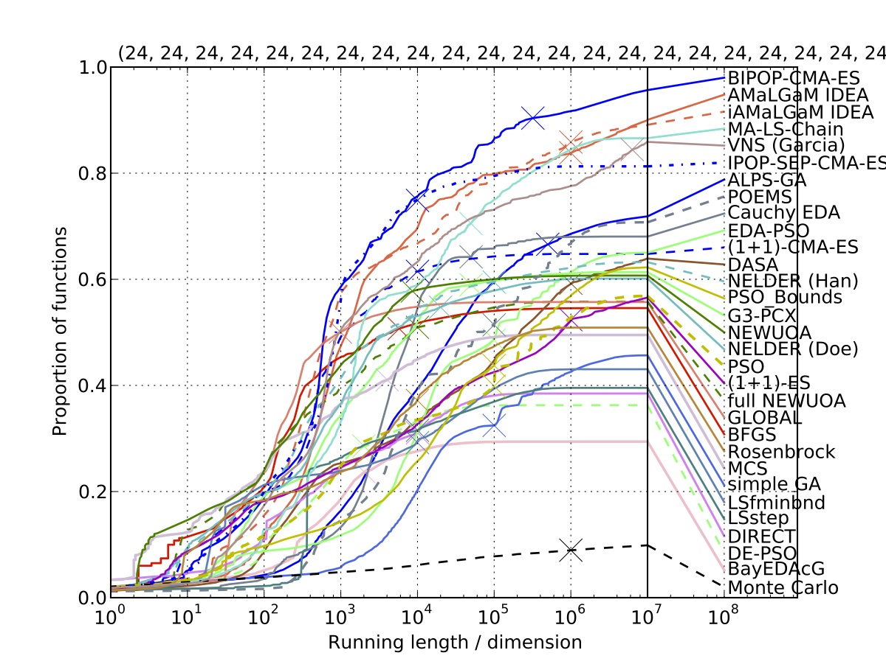

.. biobj-functions documentation master file, created by
   sphinx-quickstart on Thu Dec 24 16:35:27 2015.
   You can adapt this file completely to your liking, but it should at least
   contain the root `toctree` directive.

Welcome to the documentation of the bbob-biobj functions!
=========================================================

Contents:

.. toctree::
   :maxdepth: 2

   introduction
   state-of-the-art
   our-approach
   test-functions
   tutorial

   Data profile of the 31 algorithms, submitted to BBOB-2009 on the single-objective noiseless BBOB testbed (all 24 functions with target values in {100, … , 1e-8} in dimension 10).
   The cross indicates the maximum number of function evaluations. A decline in steepness right after the cross (e.g. for IPOP-SEP-CMA-ES) indicates that the maximum number of function evaluations should have been chosen larger. A steep increase right after the cross (e.g. for simple GA) indicates that a restart should have been invoked earlier.

Proposed Structure:
-------------------
- state of the art in MO benchmarking, description of testbeds, drawbacks such as distance-based parameters
- our approach: combining well-known single-objective functions, designed to represent typical difficulties of real-world problems, idea of instances
- choice of the functions: 300 problems too much, therefore two per BBOB function group, some functions not taken because of multiple optima or because the data produced is too high, instance choices (one single id, how to come up with two instances such that the optima are not too close to each other)
- the proposed test functions and their properties
   - ideal and nadir point known
   - plot Pareto set and Pareto front of archive
   - random points in objective space
   - cuts through the search space?
- short tutorial on how to use the Coco implementation

Indices and tables
==================

* :ref:`genindex`
* :ref:`modindex`
* :ref:`search`

