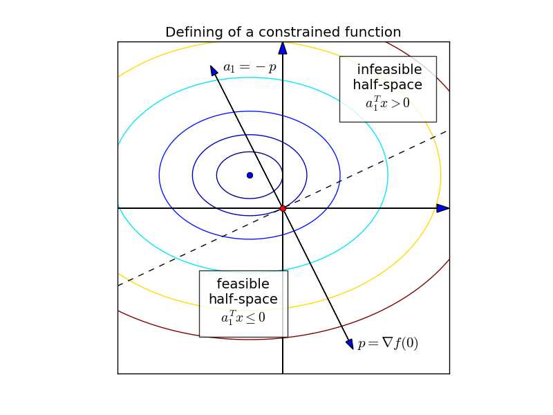
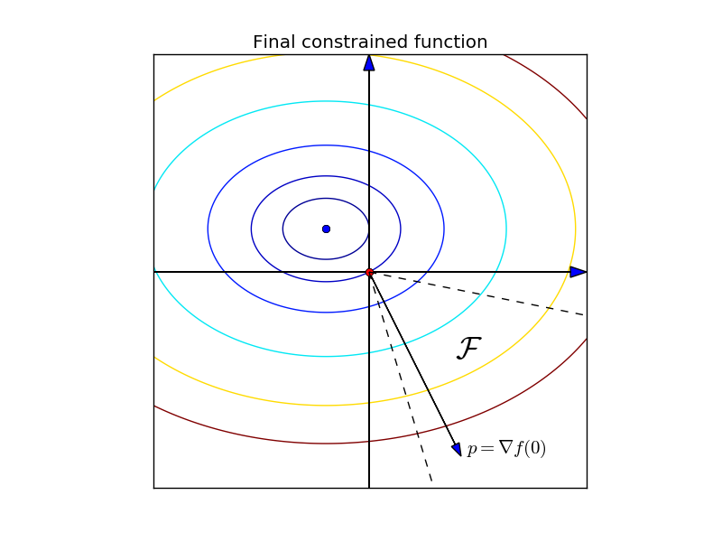
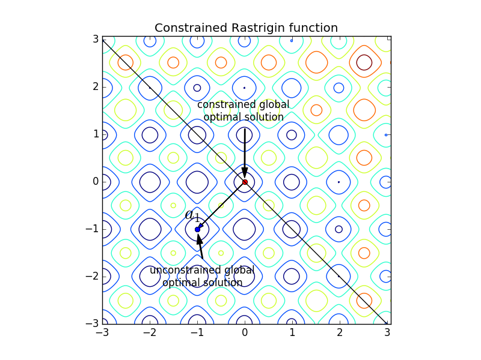

.. title:: COCO: The Linearly-Constrained Black-Box Optimization Benchmarking (bbob-constr-lin) Test Suite

$$$$$$$$$$$$$$$$$$$$$$$$$$$$$$$$$$$$$$$$$$$$$$$$$$$$$$$$$$$$$$$$$$$$$$$$$$$$$$$$$$$$$$$$$$$$$$$$$$$
COCO: The Linearly-Constrained Black-Box Optimization Benchmarking (``bbob-constr-lin``) Test Suite
$$$$$$$$$$$$$$$$$$$$$$$$$$$$$$$$$$$$$$$$$$$$$$$$$$$$$$$$$$$$$$$$$$$$$$$$$$$$$$$$$$$$$$$$$$$$$$$$$$$     

.. the next two lines are necessary in LaTeX. They will be automatically 
  replaced to put away the \chapter level as ??? and let the "current" level
  become \section. 

.. CHAPTERTITLE
.. CHAPTERUNDERLINE

.. |
.. |
.. .. sectnum::
  :depth: 3
  

  :numbered:
.. .. contents:: Table of Contents
  :depth: 2
.. |
.. |

.. raw:: latex

  % \tableofcontents TOC is automatic with sphinx and moved behind abstract by swap...py
  \begin{abstract}

The ``bbob-constr-lin`` test suite contains 48 constrained functions in continuous domain 
which are derived from combining functions of the well-known single-objective noiseless
``bbob`` test suite with randomly-generated linear constraints. This document aims to define 
those constrained functions as well as the approach used to build the linear constraints. 
It also describes how instances, targets and runtime are considered in the constrained case.

.. raw:: latex

  \end{abstract}
  \newpage

.. _COCO: https://github.com/numbbo/coco
.. _COCOold: http://coco.gforge.inria.fr
.. |coco_problem_t| replace:: 
  ``coco_problem_t``
.. _coco_problem_t: http://numbbo.github.io/coco-doc/C/coco_8h.html#a408ba01b98c78bf5be3df36562d99478

.. |coco_evaluate_constraint| replace:: 
  ``coco_evaluate_constraint``
.. _coco_evaluate_constraint: 
  http://numbbo.github.io/coco-doc/C/coco_8h.html#ab5cce904e394349ec1be1bcdc35967fa

.. |f| replace:: :math:`f`
.. |g| replace:: :math:`g`

.. summarizing the state-of-the-art in linearly-constrained black-box benchmarking, 
.. and at providing a simple tutorial on how to use these functions for actual benchmarking within the Coco framework.

.. .. Note::
  
  For the time being, this documentation is under development and might not 
  contain all final data.

.. #################################################################################
.. #################################################################################
.. #################################################################################

.. _sec-introduction:

Introduction
============
We consider constrained optimization problems of the form

.. math:: 
   :nowrap:
   :label: cons_prob

   \begin{eqnarray*}
   \begin{array}{rcl}
   \displaystyle\min_{x \in \mathbb{R}^n} & f(x) & \\
          \textrm{s.t.:} & g_i(x) \leq 0, & i = 1, \ldots, l,\\
   \end{array}
   \end{eqnarray*}

where :math:`n` is the number of variables of the problem (also called
the problem dimension), :math:`f: \mathbb{R}^n \rightarrow \mathbb{R}`
is the objective function, and :math:`g_i: \mathbb{R}^n \rightarrow \mathbb{R}`, :math:`i = 1, \ldots, l`, 
are the constraint functions defined by :math:`g_i(x) \equiv a_i^T x`, with :math:`a_i \in \mathbb{R}^{n}`.

A point :math:`x \in \mathbb{R}^n` is said to be a *feasible solution* if :math:`g_i(x) \leq 0` for all :math:`i`.
The set of all feasible solutions is called the *feasible set*, denoted here by :math:`\cal F`. An *optimal
solution* is a point :math:`x^{\textrm{opt}} \in \cal F` such that :math:`f(x^{\textrm{opt}}) \leq f(x)` for all :math:`x \in \cal F`. 
We also make distinction between *global optimal solution* and *local optimal solution*.
The latter is a point :math:`x^{\textrm{opt}} \in \cal F` such that :math:`f(x^{\textrm{opt}}) \leq f(x)` for all :math:`x \in \cal N \cap \cal F`, 
where :math:`\cal N` is a neighborhood of :math:`x^{\textrm{opt}}`, while the former considers the entire set :math:`\cal F` in the definition. 
In this documentation, we always refer the term "optimal solution" to "global optimal solution" and vice-versa. The latter term is used
in contexts where local optimal solutions are also in discussion.

A point :math:`x^{\textrm{opt}} \in \mathbb{R}^n` is said to be an *unconstrained optimal solution* to :eq:`cons_prob` if :math:`f(x^{\textrm{opt}}) \leq f(x)` 
for all :math:`x \in \mathbb{R}^n`. Note that this definition does not require :math:`x^{\textrm{opt}}` to be feasible. In other words,
the constraints :math:`g_i` of the problem are not been considered in the definition. We consider the definition of a *constrained optimal solution* to be equal to that of an optimal solution, i.e. with the constraints being taken into account. By using
the definitions of global and local optimal solutions given before, we go a step further to define *unconstrained global optimal solutions* and *unconstrained local optimal solutions*, where the constraints are not considered, as well as *constrained global optimal solutions* and *constrained local optimal solutions*, where the constraints are taken into account.

Before delving into detail about how the constrained problems are built, we familiarize the reader with some terms that are used in the `Coco framework` and, in particular, in this suite.

.. |n| replace:: :math:`n`
.. |m| replace:: :math:`m`
.. |theta| replace:: :math:`\theta`
.. |i| replace:: :math:`i`
.. |j| replace:: :math:`j`
.. |k| replace:: :math:`k`
.. |t| replace:: :math:`t`
.. |fi| replace:: :math:`f_i`

Terminology
-----------

*Objective function* or, simply, *function*
  An objective function :math:`f`, also referred to as function in `Coco`, is a parametrized mapping
  :math:`\mathbb{R}^n\to\mathbb{R}` with scalable input space, :math:`n\ge2`.
  Functions are parametrized such that different *instances* of the
  "same" function are available, e.g. translated or shifted versions. 

*Constraint*
  A constraint function :math:`g_i` is a parametrized mapping
  :math:`\mathbb{R}^n\to\mathbb{R}` with scalable input space, :math:`n\ge2`.
  Constraints are also parametrized such that different *instances* of the
  "same" constraint are available, e.g. translated or shifted versions. 
  Since translations and shiftings of linear constraints result on different
  linear constraints, different instances of a constraint in the ``bbob-constr-lin``
  test suite are equivalent to different constraints. In the next section,
  we give more details on the parameters of a constraint and how they are used
  to define the instances.

*Constrained function*
  A *constrained function* is a function :math:`f(x)` subject to constraints 
  :math:`g_i(x)\leq 0`, :math:`i=1,\ldots,l`. For example, in :eq:`cons_prob`, we are minimizing a constrained function. 
  Constrained functions are parametrized such that different *instances* of the
  "same" constrained function are available. In the next section, we describe
  how the idea of instance is employed in the constrained case.
  
*runtime*
  We define *runtime*, or *run-length* as the *number of
  evaluations* conducted on a given problem until a prescribed target value is
  hit, also referred to as the sum of the number of *objective function* evaluations 
  and the number of *constraint* evaluations. We emphasize here that one single 
  *constraint evaluation* in `Coco` is equivalent to one call to the routine that 
  evaluates *all* the constraints at once, 
  |coco_evaluate_constraint|_. Runtime is our central performance measure.

.. _subsec-instances-and-problems:

Instances and problems
----------------------

*constrained function instance*
  Each constrained function is parametrized by the (input) dimension, |n|, its identifier |i|, 
  and the instance number, |j|.

  The parameter value |j| determines a so-called *constrained function 
  instance*. This value is used in the ``bbob-constr-lin`` test suite to 

  (1) define an instance of the objective function,
  (2) define an instance of the constraints in the constrained function,
  (3) encode the location of the optimal solution of the constrained function.

  **IMPORTANT:** constrained functions with the same objective function but with different constraints are 
  distinguished from each other and thus have different identifiers.

  A constraint :math:`g_k` in a constrained function :math:`f_i` is parametrized by the (input) 
  dimension, |n|, the identifier of the constrained function, |i|, its identifier within the 
  set of constraints, :math:`k\in\{1,\ldots,l\}`, and the instance number of the constrained 
  function, |j|. The parametrized constrained function :math:`f_i` is then denoted by

  .. math::

    f(n, i, j)(x) \quad \textrm{subject to}\quad g(n, i, k, j)(x) \leq 0, \quad k = 1, \ldots, l.

  The rationale behind the use of parameter |k| is the following. Suppose that a constrained function
  is composed of the objective function and two linear constraints :math:`g_1(x) \equiv a_i^T x` and 
  :math:`g_2(x) \equiv a_2^T x`. The gradients :math:`a_1` and :math:`a_2` are randomly generated
  using the identifier of the constrained function, |i|, and the instance number, |j|, in the seed
  formula. However, using only these values for generating these vectors would result on
  identical gradients as the same seed would be used in the building process. By using also their identifiers, 
  1 and 2, we can generate different gradients, and, therefore, different constraints.

  As previously mentioned, translations and shiftings of linear constraints result on different
  linear constraints. Therefore, different instances of a constraint in the ``bbob-constr-lin``
  test suite are equivalent to different constraints.

*problem*
  We talk about a *problem*, |coco_problem_t|_, as a specific *constrained function instance* 
  on which an optimization algorithm is run. 
  A problem
  can be evaluated and returns an |f|-value or -vector and, in case,
  a |g|-vector. 
  In the context of performance assessment, a target :math:`f`- or
  indicator-value is added to define a problem. 

.. _subsec-raw-and-transformed-functions:

Raw functions and transformed functions
---------------------------------------

In the `Coco framework`, we call raw functions those functions without any linear or nonlinear transformation as opposed to a transformed function, which is a raw function where some transformation has been applied to. For example, the *raw sphere function* in the ``bbob`` test suite is given by

.. math::

  f(x) = \| x \|^2.

As it can be seen, neither linear nor nonlinear transformations have been applied to the function above. The transformed sphere function -- or simply, as it is called in `Coco`, *sphere function* -- is defined as

.. math::

  f(x) = \|x-x^{\textrm{opt}}\|^2 + f_{\textrm{opt}},

where the vector :math:`x^{\textrm{opt}}` and the scalar :math:`f_{\textrm{opt}}` are constants whose values depend on the function identifier and instance number. These constants determine the optimal solution and the optimal function value of the problem, respectively.

Linear transformations, by definition, do not change some properties of the functions to which they are applied to, such as symmetry. In order to make the functions less regular, `Coco` makes use of two nonlinear transformations, namely, :math:`T_{\textrm{asy}}^{\beta}` and :math:`T_{\textrm{osz}}` [HAN2009]_. The former is a symmetry breaking transformation while the latter introduces small, smooth but clearly visible irregularities. These nonlinear transformations can transform convex raw functions into nonconvex functions, for instance.

.. _sec-overview-test-suite:

Overview of the proposed ``bbob-constr-lin`` test suite
=======================================================

The ``bbob-constr-lin`` test suite provides 48 constrained functions in six
dimensions (2, 3, 5, 10, 20, and 40) with a large number of possible instances. 
The 48 functions are derived from combining 8 single-objective functions 
with 6 different numbers of linear constraints: 1, 2, 10, :math:`n/2`, :math:`n-1`
and :math:`n+1`.

While concrete details on each of
the 48 ``bbob-constr-lin`` constrained functions are given in Section
:ref:`sec-test-constrained-functions`, we will detail here the main rationale behind
them together with their common properties.

.. _subsec-main-features:

Main features
-------------

We summarize below the main features of the constrained functions in the ``bbob-constr-lin`` test suite.

* Linear constraints
  
* Scalable with dimension

* Non-trivial, with a few exceptions
  
* Mostly non-separable
  
* Known optimal function values

* Use many functions already implemented in `Coco` as objective functions

* Different number of constraints: :math:`1`, :math:`2`, :math:`10`, :math:`n/2`, :math:`n-1`, :math:`n+1`

* The constraints are randomly generated

.. _subsec-how-cons-are-built:

How the constraints are built
-----------------------------

The linear constraints :math:`g_i` are defined by their gradients :math:`a_i` which are randomly generated using a normal distribution.
In order to ensure that the resulting feasible set contains points other than the origin, the following steps are considered in the generation process.
  
1) Sample :math:`l` vectors :math:`a_1`, :math:`a_2`, :math:`\ldots`, :math:`a_l`.

2) Choose a point :math:`p` that will be a feasible solution.

3) For each vector :math:`a_i` such that :math:`a_i^T p > 0`, redefine :math:`a_i = -a_i`.

4) Define the constraints :math:`g_i` using the vectors :math:`a_1`, :math:`a_2`, :math:`\ldots`, :math:`a_m`.

The algorithm above ensures a feasible half-line defined by :math:`\{\alpha p\,|\,\alpha\geq0\}`.

.. _subsec-defining-the-constrained-functions:

Defining the constrained functions
----------------------------------

The constrained functions are defined in a way such that their optimal solutions are different from the optimal solutions of their unconstrained counterparts. The reason for this choice lies in the fact that if both optimal solutions were equal, the constraints would have no major impact in the difficulty of the problem in the sense that an algorithm for unconstrained optimization could be run and obtain the optimal solution without considering any constraint.

Before describing how we define a point as an optimal solution to a constrained function, we introduce some conditions for a solution to be optimal called the *Karush-Kuhn-Tucker* conditions, or, simply, the KKT conditions. Such conditions are first-order necessary conditions for optimality given that the problem satisfies some regularity conditions. 

**The Karush-Kuhn-Tucker conditions**

Suppose that the function :math:`f` and the constraints :math:`g_i` are continuously differentiable at a point :math:`x^{\textrm{opt}}` and that the problem satisfies some regularity conditions (for instance, the functions :math:`g_i` being affine, which is our case as they are linear). If :math:`x^{\textrm{opt}}` is a local optimal solution, then there exist constants :math:`\mu_i`, :math:`i=1,\ldots,l` called *Lagrange multipliers*, such that

.. math::
  
  \nabla f(x^{\textrm{opt}}) + \displaystyle\sum_{i=1}^m \mu_i \nabla g_i(x^{\textrm{opt}}) = 0, 

  g_i(x^{\textrm{opt}}) \leq 0, \quad i = 1, \ldots, l,

  \mu_i g_i(x^{\textrm{opt}}) = 0, \quad i = 1, \ldots, l,

  \mu_i \geq 0, \quad i = 1, \ldots, l.

A point that satisfies the KKT conditions is called a *KKT point*. Note that a KKT point is not necessarily a local optimal solution. The KKT conditions may be sufficient for optimality if some additional conditions are satisfied; for instance, if the objective function and the constraints :math:`g_i` are convex and constinuously differentiable over :math:`\R^D`. Furthermore, when convexity holds, the KKT point is also a global optimal solution. A more general result states that if the objective function is pseudoconvex and the constraints :math:`g_i` are quasiconvex, then the KKT conditions are sufficient for optimality and the KKT point is a global optimal solution. 

**Generic algorithm for defining the constrained functions**

Initially, we choose the origin to be the optimal solution of the constrained functions. Then, we pick up a ``bbob`` function to be the objective function and we build the linear constraints in such a way that the origin becomes a KKT point and also the optimal solution to the final constrained function. The first steps for constructing the constrained functions can be summarized in an algorithmic way as it follows. Assume for now that the chosen ``bbob`` function does not contain any nonlinear transformation in its definition.

1. Pick up a ``bbob`` function :math:`f` to be the objective function.

2. Define the feasible direction :math:`p` as :math:`\nabla f(\mathbf{0})`.

3. Define the first constraint function :math:`g_1(x)` by setting its gradient to :math:`a_1 = -p`.

4. Generate the other constraints randomly using a normal distribution while making sure that :math:`p` remais feasible for each one.

The point :math:`p=\nabla f(\mathbf{0})` defined in Step 2 is used in the definition of the first linear constraint in Step 3 and also to guarantee that the feasible set has more points than just the origin in Step 4 (see Subsection :ref:`subsec-how-cons-are-built`). By setting the Lagrange multipliers :math:`\mu_1 = 1` and :math:`\mu_i = 0` for :math:`i=2,\ldots,l`, we have that all the KKT conditions are satisfied at the origin, which makes it a KKT point. We give below an example of the definition of a constrained function with two figures. The figure on the left shows the Steps 1 to 3 while the one on the right shows the final constrained function. The hashed lines form the boundary of the feasible set :math:`\cal F` in each figure. Note that the point :math:`p` remains feasible after the addition of other linear constraintes in the figure on the right.

.. _fig-res-cons-func:

+---------+---------+
| |logo1| | |logo2| |
+---------+---------+

7 out of the 8 objective functions - all except the Rastrigin function, which is handled differently - composing the constrained functions in ``bbob-constr-lin`` are convex or pseudoconvex - without considering the nonlinear transformations -, which together with the fact that every linear constraint is also quasiconvex implies that a KKT point is also a global optimal solution to these constrained functions.

If the ``bbob`` function chosen in Step 2 includes nonlinear transformations, the algorithm above cannot ensure that the origin is the optimal solution due to the lack of pseudoconvexity of the objective function, which was used to guarantee the sufficiency of the KKT conditions for optimality. To solve this issue, we add a new step between Step 1 and Step 2 where we remove the nonlinear transformations applied to the search space in the ``bbob`` function. The nonlinear transformations are applied to the whole constrained function (:math:`f` and :math:`g_i`) only after the constraints have been built and the origin has been defined as the optimal solution. As we show in the Subsection :ref:`subsec-applying-nonlinear-transformations`, the application of the `Coco` nonlinear transformations to a constrained function whose optimal solution is at the origin does not change its optimal solution. 

The final generic algorithm for defining the constrained functions is given below. As it can be seen, we also added a new step to move the optimal solution away from the origin in the end.

1. Pick up a ``bbob`` function :math:`f` to be the objective function.

2. Remove possible nonlinear transformations from :math:`f`.

3. Define the feasible direction :math:`p` as :math:`\nabla f(\mathbf{0})`.

4. Define the first constraint function :math:`g_1(x)` by setting its gradient to :math:`a_1 = -p`.

5. Generate the other constraints randomly using a normal distribution while making sure that :math:`p` remais feasible for each one.

6. Apply to the whole constrained function (objective function + constraints) the nonlinear transformations that were removed from the objective function in Step 2.

7. Choose a random point :math:`x^{\textrm{opt}}` and move the optimal solution away from the origin by translating the constrained function (objective function + constraints) by :math:`-x^{\textrm{opt}}`.

**Defining the constrained Rastrigin function**

The process described before works for all the constrained functions in the current test suite except the one involving the Rastrigin function as it is a multimodal function. Its definition in ``bbob-constr-lin`` differs from that in the ``bbob`` test suite, being given here by

.. math::
   :label: rastrigin
   :nowrap:

   \begin{eqnarray*}
   \begin{array}{rc}
                          & f(x) = 10\bigg(n - \displaystyle\sum_{i=1}^{n}\cos(2\pi z_i) \bigg) + \|z\|^2 + f_{\textrm{opt}} \\
      \textrm{subject to} & g_i(v) \leq 0, \quad i = 1, \ldots, l,\\
   \end{array}
   \end{eqnarray*}

where :math:`v = T_{\textrm{asy}}^{0.2}(T_{\textrm{osz}}(x - x^{\textrm{opt}}))` and :math:`z = v-x^{\textrm{shift}}`. Without the nonlinear transformations and the translation by :math:`-x^{\textrm{opt}}`, it becomes

.. math::
   :label: rastrigin2
   :nowrap:

   \begin{eqnarray*}
   \begin{array}{rcl}
                         & f(x) = 10\bigg(n - \displaystyle\sum_{i=1}^{n}\cos\Big(2\pi (x_i-x^{\textrm{shift}}_i)\Big) \bigg) + \|x-x^{\textrm{shift}}\|^2 + f_{\textrm{opt}} \\
          \textrm{subject to} & g_i(x) \leq 0, \quad i = 1, \ldots, l.\\
   \end{array}
   \end{eqnarray*}

Differently from the other 7 constrained functions, :eq:`rastrigin2` does not have a pseudoconvex objective function. Therefore, we define the optimal solution in this case in a different manner. We first set the constant vector :math:`x^{\textrm{shift}}=(-1,\ldots,-1)^T`. We then obtain a Rastrigin function whose unconstrained global optimal solution is at :math:`x^{\textrm{shift}}=(-1,\ldots,-1)^T`. By defintion, such a function contains many local optimal solution which are (approximately) located on the :math:`n`-dimensional integer lattice :math:`\mathbb{Z}^n` translated by :math:`-x^{\textrm{shift}}`.

Due to the translation of the objective function by :math:`-x^{\textrm{shift}}`, the origin is no more the unconstrained global optimal solution, but an unconstrained local optimal solution. In order to make it the constrained global optimal solution, we add a linear constraint function :math:`g_1(x) \equiv a_1^T x` whose gradient is given by :math:`a_1 = x^{\textrm{shift}}`. :numref:`fig-cons-rastrigin` shows a 2-dimensional example of the resulting function. As it can be seen, all the constrained local optimal solutions in the integer lattice, situated in the upper right part of of the graph, have function values larger than the origin's due to the fact that they are farther with respect to the unconstrained global optimal solution, :math:`x^{\textrm{shift}}=(-1,\ldots,-1)^T`, which increases the value of the term :math:`\|x-x^{\textrm{shift}}\|^2` in the function and thus the function value itself.

.. _fig-cons-rastrigin:

   Constrained Rastrigin function in :eq:`rastrigin2` with one single linear constraint :math:`g_1(x)\equiv a_1^T x \leq 0`, where :math:`a_1=x_{\textrm{shift}}=(-1,\ldots,-1)^T`.

Next, all the other linear constraints are randomly generated while care is taken to keep the point :math:`p=-a_1=(1,\ldots,1)^T` feasible in order to guarantee at least a feasible half-line defined by :math:`\{\alpha p\,|\,\alpha\geq0\}`. We then apply the nonlinear transformations :math:`T_{\textrm{osz}}` and :math:`T_{\textrm{asy}}^{0.2}` to the constrained function to make it less regular. Finally, we choose a random vector :math:`x^{\textrm{opt}}` to be the optimal solution and translate the constrained function by :math:`-x^{\textrm{opt}}`.

.. _subsec-applying-nonlinear-transformations:

Applying nonlinear transformations
----------------------------------

As we mentioned in the previous subsection, we initially do not consider the nonlinear transformations in the building process of the constrained functions. Those transformations are applied after defining the optimal solutions. The application of nonlinear transformations to the constrained functions, however, do not affect the location of the optimal solutions already defined as we show next.

Without loss of generality, consider the minimization of a constrained function with one single linear constraint:

.. math:: 
   :nowrap:
   :label: cons_prob_trans1

   \begin{eqnarray*}
   \begin{array}{rc}
   \displaystyle\min_{x \in \mathbb{R}^n} & f(x) \\
          \textrm{s.t.:} & g(x) \equiv a^T x \leq 0. \\
   \end{array}
   \end{eqnarray*}

Let :math:`t:\mathbb{R}^n \rightarrow \mathbb{R}^n` be an injective transformation function.  By "applying" :math:`t` to :eq:`cons_prob_trans1`, we obtain

.. math:: 
   :nowrap:
   :label: cons_prob_trans2

   \begin{eqnarray*}
   \begin{array}{rc}
   \displaystyle\min_{x \in \mathbb{R}^n} & f(t(x)) \\
          \textrm{s.t.:} & g(t(x)) \equiv a^T t(x) \leq 0. \\
   \end{array}
   \end{eqnarray*}

Assume that :math:`x^{\textrm{opt}}` is an optimal solution to :eq:`cons_prob_trans1`. Since :math:`t` is injective, it has an inverse :math:`t^{-1}`. It follows that :math:`t^{-1}(x^{\textrm{opt}})` is an optimal solution to :eq:`cons_prob_trans2`.

**Proof:** Suppose, by contradiction, that :math:`t^{-1}(x^{\textrm{opt}})` is not an optimal solution to :eq:`cons_prob_trans2`. Then there exists a point :math:`u` such that 

.. math:: 
   :label: nonlin_trans_proof

   g(t(u)) = a^T t(u) \leq 0\quad  \textrm{ and } \quad f(t(u)) < f(t(t^{-1}(x^{\textrm{opt}}))) = f(x^{\textrm{opt}})

Let :math:`z = t(u)`. Then, :math:`t^{-1}(z) = u`. By :eq:`nonlin_trans_proof` and the property of inverse functions, we have that

.. math:: 

   a^T z \leq 0\quad \textrm{ and } \quad f(t(u)) = f(t(t^{-1}(z)) = f(z) < f(x^{\textrm{opt}}).  

This contradicts the assumption of :math:`x^{\textrm{opt}}` being a global minimum to problem :eq:`cons_prob_trans1`. **Q.E.D.**

Since the transformations :math:`T_{\textrm{asy}}^{\beta}` and :math:`T_{\textrm{osz}}` in ``Coco`` are strictly increasing functions, they both are injective, thus having inverse functions. Since the optimal solution :math:`x^{\textrm{opt}}` to :eq:`cons_prob_trans1` is defined as the origin in the construction of the constrained functions, the proof given above implies that :math:`t^{-1}(x^{\textrm{opt}}) = t^{-1}(\mathbf{0})` is an optimal solution to :eq:`cons_prob_trans2`. Besides that, by definition of :math:`T_{\textrm{asy}}^{\beta}` and :math:`T_{\textrm{osz}}`, we have that :math:`t(\mathbf{0})=\mathbf{0}` for any of these two transformations. Using this together with the fact that :math:`t(t^{-1}(\mathbf{0}))=\mathbf{0}` (by the property of inverse functions) and by the injectivity of :math:`t`, we must have :math:`t^{-1}(\mathbf{0})=\mathbf{0}`. This implies that the origin is still the optimal solution after any of these two nonlinear transformations have been applied to the constrained function.

.. _sec-test-constrained-functions:

The ``bbob-constr-lin`` constrained functions and their properties
==================================================================

We now detail the 48 ``bbob-constr-lin`` constrained functions and the common properties of the objective functions composing them.

In total, there are 8 different objective functions, and each one is tested with 6 different numbers of linear constraints: :math:`1`, :math:`2`, :math:`10`, :math:`n/2`, :math:`n-1` and :math:`n+1`. The first objective function in the suite is given by the sphere function. The first constrained function, :math:`f_1`, is thus defined by the sphere function subject to 1 linear constraint. The second constrained function, :math:`f_2`, is defined by the sphere function subject to 2 linear constraints. The third cosntrained function, :math:`f_3`, is defined by the shpere function subject to 10 linear constraints, and so on. The 7th constrained function, :math:`f_7`, is then defined by the ellipsoidal function (the second objective function) subject to 1 linear constraint, and the same process repeats. 

The number of linear constraints, :math:`l`, in a constrained function :math:`f_i` can be easily obtained through the formula :math:`((i-1) \bmod 6) + 1`. For instance, consider the constrained function :math:`f_7` which is the ellipsoid function subject to 1 linear constraint. We can know that is has 1 linear constraint by its identifier by computing :math:`((7-1) \bmod 6) + 1 = (6 \bmod 6 ) + 1 = 1`.

We separate the 48 constrained functions into groups with respect to their objective function, thereby having 8 groups. Each group contains 6 different constrained functions as each objective function is tested with 6 different numbers of linear constraints. We list the groups below with some properties of the objective fuctions that define them. As described in the Subsection :ref:`subsec-defining-the-constrained-functions`, by translating the objective function and the constraints with the use of the randomly-generated point :math:`x^{\textrm{opt}}`, we define :math:`x^{\textrm{opt}}` as the optimal solution. On the other hand, by translating the objective function only with the use of the randomy-generated point :math:`x^{\textrm{shift}}`, we guarantee that the constrained optimal solution, :math:`x^{\textrm{opt}}`, is different from the unconstrained optimal solution, :math:`x^{\textrm{shift}}`.

**Group 1 - Constrained Sphere function:** :math:`f_1` -- :math:`f_6`

.. math::
  :label: cons_fun_sphere
  :nowrap:

   \begin{eqnarray*}
   \begin{array}{rc}
                          & f(x) = \|z\|^2 + f_{\textrm{opt}} \\
                          & \\
      \textrm{subject to} & g_i(v) \leq 0, \quad i = 1, \ldots, l,\\
   \end{array}
   \end{eqnarray*}

where :math:`v = x-x^{\textrm{opt}}` and :math:`z = v-x^{\textrm{shift}}`.

* Presumably the most easy continuous domain search problem, given the volume of the searched solution is small.

* Unimodal, highly symmetric, rotationally invariant and scale invariant.

**Group 2 - Constrained Ellipsoid function:** :math:`f_7` -- :math:`f_{12}`

.. math::
  :label: cons_fun_ellipsoidal
  :nowrap:

   \begin{eqnarray*}
   \begin{array}{rc}
                          & f(x) = \displaystyle\sum_{i=1}^{n} 10^{6\frac{i-1}{n-1}} z_i^2 + f_{\textrm{opt}} \\
                          & \\
      \textrm{subject to} & g_i(v) \leq 0, \quad i = 1, \ldots, l,\\
   \end{array}
   \end{eqnarray*}

where :math:`v = T_{\textrm{osz}}(x-x^{\textrm{opt}})` and :math:`z = v-x^{\textrm{shift}}`.

* Globally quadratic and ill-conditioned function with smooth local irregularities.

* Unimodal, separable and conditioning about :math:`10^6`.

**Group 3 - Constrained Linear Slope:** :math:`f_{13}` -- :math:`f_{18}`

.. math::
  :label: cons_fun_linear_slope
  :nowrap:

   \begin{eqnarray*}
   \begin{array}{rc}
                          & f(x) = \displaystyle\sum_{i=1}^{n} 5 |s_i| - s_i\,z_i + f_{\textrm{opt}} \\
                          & \\
      \textrm{subject to} & g_i(v) \leq 0, \quad i = 1, \ldots, l,\\
   \end{array}
   \end{eqnarray*}

where :math:`v = x-x^{\textrm{opt}}`, and :math:`z_i = v_i`  if :math:`x^{\textrm{shift}}_i v_i < 5^2` and 
:math:`z_i = x^{\textrm{shift}}_i` otherwise, for  :math:`i = 1, \dots, n`.

* Purely linear function.

**Group 4 - Constrained Ellipsoid Rotated:** :math:`f_{19}` -- :math:`f_{24}`

.. math::
  :label: cons_fun_ellipsoid_rotated
  :nowrap:

   \begin{eqnarray*}
   \begin{array}{rc}
                          & f(x) = \displaystyle\sum_{i=1}^{n} 10^{6\frac{i-1}{n-1}} z_i^2 + f_{\textrm{opt}} \\
                          & \\
      \textrm{subject to} & g_i(v) \leq 0, \quad i = 1, \ldots, l,\\
   \end{array}
   \end{eqnarray*}

where :math:`v = T_{\textrm{osz}}(x-x^{\textrm{opt}})` and :math:`z = R\,(v-x^{\textrm{shift}})`.

* Globally quadratic ill-conditioned function with smooth local irregularities, non-separable counterpart to the functions in Group 2.

* Unimodal, conditioning about :math:`10^6` and non-separable.

**Group 5 - Constrained Discus function:** :math:`f_{25}` -- :math:`f_{30}`

.. math::
  :label: cons_fun_discus
  :nowrap:

   \begin{eqnarray*}
   \begin{array}{rc}
                          & f(x) = 10^6 z_1^2 + \displaystyle\sum_{i=2}^{n} z_i^2 + f_{\textrm{opt}} \\
                          & \\
      \textrm{subject to} & g_i(v) \leq 0, \quad i = 1, \ldots, l,\\
   \end{array}
   \end{eqnarray*}

where :math:`v = T_{\textrm{osz}}(x-x^{\textrm{opt}})` and :math:`z = R\,(v-x^{\textrm{shift}})`.

* Globally quadratic function with local irregularities. A single direction in search space is a thousand times more sensitive than all others.

* Conditioning is about :math:`10^6`.

**Group 6 - Constrained Bent Cigar function:** :math:`f_{31}` -- :math:`f_{36}`

.. math::
  :label: cons_fun_bent_cigar
  :nowrap:

   \begin{eqnarray*}
   \begin{array}{rc}
                          & f(x) = z_1^2 + 10^6\displaystyle\sum_{i=2}^{n} z_i^2 + f_{\textrm{opt}} \\
                          & \\
      \textrm{subject to} & g_i(v) \leq 0, \quad i = 1, \ldots, l,\\
   \end{array}
   \end{eqnarray*}

where :math:`v = T_{\textrm{asy}}^{0.5}\,(x-x^{\textrm{opt}})` and :math:`z = R\,R\,(v-x^{\textrm{shift}})`.

* A ridge defined as :math:`\sum_{i=2}^{n} z_i^2 = 0` needs to be followed. The ridge is smooth but very narrow. Due to :math:`T_{\textrm{asy}}^{0.5}`, the overall shape deviates remarkably from being quadratic.

* Conditioning is about :math:`10^6`, rotated and unimodal.

**Group 7 - Constrained Different Powers function:** :math:`f_{37}` -- :math:`f_{42}`

.. math::
  :label: cons_fun_different_powers
  :nowrap:

   \begin{eqnarray*}
   \begin{array}{rc}
                          & f(x) = \sqrt{10^6\displaystyle\sum_{i=1}^{n} |z_i|^{2+4\frac{i-1}{n-1}}} + f_{\textrm{opt}} \\
                          & \\
      \textrm{subject to} & g_i(v) \leq 0, \quad i = 1, \ldots, l,\\
   \end{array}
   \end{eqnarray*}

where :math:`v = x-x^{\textrm{opt}}` and :math:`z = R\,(v-x^{\textrm{shift}})`.

* Due to the different exponents the sensitivies of the :math:`z_i` variables become more and more different when approaching the unconstrained optimal solution.

* Unimodal, small solution volume and rotated.

**Group 8 - Constrained Rastrigin function:** :math:`f_{43}` -- :math:`f_{48}`

.. math::
  :label: cons_fun_rastrigin
  :nowrap:

   \begin{eqnarray*}
   \begin{array}{rc}
                          & f(x) = 10\bigg(n - \displaystyle\sum_{i=1}^{n}\cos(2\pi z_i) \bigg) + \|z\|^2 + f_{\textrm{opt}} \\
                          & \\
      \textrm{subject to} & g_i(v) \leq 0, \quad i = 1, \ldots, l,\\
   \end{array}
   \end{eqnarray*}

where :math:`v = T_{\textrm{asy}}^{0.2}\,(T_{\textrm{osz}}(x-x^{\textrm{opt}}))` and :math:`z = v-x^{\textrm{shift}}`.

* Highly multimodal function with a comparatively regular structure for the placement of the local optimal solutions. The transformations :math:`T_{\textrm{asy}}` and :math:`T_{\textrm{osz}}` alleviate the symmetry and regularity of the original Rastrigin function.

* Roughly :math:`10^n` local optimal solutions, conditioning is about :math:`10^6`.

* As explained in the previous section, :math:`x^{\textrm{shift}}=(-1,\ldots,-1)^T` for this constrained function.

.. _`Coco framework`: https://github.com/numbbo/coco

.. raw:: html
    
    <H2>Acknowledgments</H2>

.. raw:: latex

    \section*{Acknowledgments}

This work was supported by the grant ANR-12-MONU-0009 (NumBBO) 
of the French National Research Agency.

 
.. ############################# References #########################################
.. raw:: html
    
    <H2>References</H2>
   
.. [HAN2016co] N. Hansen, A. Auger, O. Mersmann, T. Tušar, D. Brockhoff (2016).
   `COCO: A Platform for Comparing Continuous Optimizers in a Black-Box 
   Setting`__, *ArXiv e-prints*, `arXiv:1603.08785`__. 
.. __: http://numbbo.github.io/coco-doc/
.. __: http://arxiv.org/abs/1603.08785

.. [HAN2009] N. Hansen, S. Finck, R. Ros, and A. Auger (2009). 
   `Real-parameter black-box optimization benchmarking 2009: Noiseless
   functions definitions`__. `Research Report RR-6829`__, Inria, updated
   February 2010.
.. __: http://coco.gforge.inria.fr/
.. __: https://hal.inria.fr/inria-00362633

  
