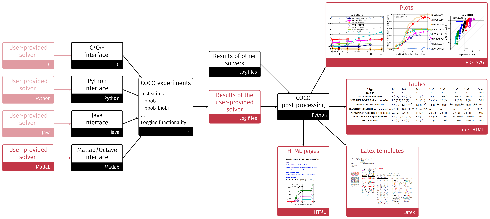

# A Short Introduction to COCO  #
---

For a general introduction to the COCO software and its underlying concepts of performance assessment, please see this [Optimization Methods and Software journal article](https://www.tandfonline.com/doi/abs/10.1080/10556788.2020.1808977) or its publicly available version [on HAL](https://hal.inria.fr/hal-01294124v4/document)

<link rel="stylesheet" href="{{ '/assets/css/custom.css' | relative_url }}"/>
