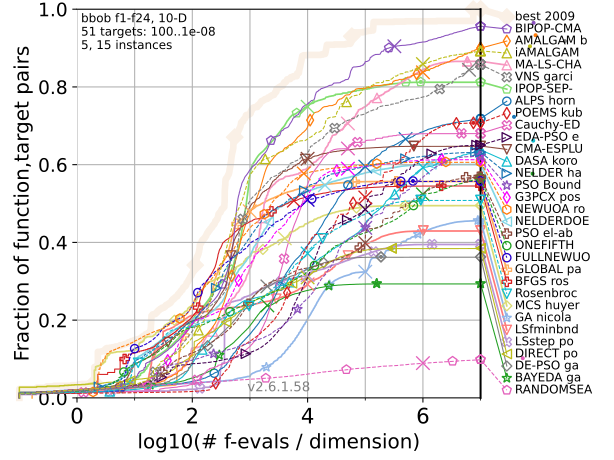

# The bbob Test Suite

<table>
	<tr>
		<td style="width=50%">
			The blackbox optimization benchmarking (bbob) test suite is COCO's standard test suite with 24 noiseless, single-objective and scalable test functions. Each function is provided in dimensions (2, 3, 5, 10, 20, 40) and in 15 instances, however also available for arbitrary dimensions and number of instances. Links to their definition with visualizations are provided in the table.
		</td>
		<td style="padding-top:0px; padding-bottom:0px;">
			
		</td>
	</tr>
</table>

<table align="center" style="width:50%">
<tr>
   <th colspan=2 style="text-align:left; padding-bottom: 0px;">1 Separable Functions</th>
</tr>
<tr>
	<td style="width:5%; padding-top:0px; padding-bottom: 0px;">f1</td><td style="padding-top:0px; padding-bottom:0px;"><a href="https://numbbo.github.io/gforge/downloads/download16.00/bbobdocfunctions.pdf#page=5">Sphere Function</a></td>
</tr><tr>
	<td style="padding-top:0px; padding-bottom:0px;">f2</td><td style="padding-top:0px; padding-bottom:0px;"><a href="https://numbbo.github.io/gforge/downloads/download16.00/bbobdocfunctions.pdf#page=10">Separable Ellipsoidal Function</a></td>
</tr><tr>
	<td style="padding-top:0px; padding-bottom:0px;">f3</td><td style="padding-top:0px; padding-bottom:0px;"><a href="https://numbbo.github.io/gforge/downloads/download16.00/bbobdocfunctions.pdf#page=15">Rastrigin Function</a></td>
</tr><tr>
	<td style="padding-top:0px; padding-bottom:0px;">f4</td><td style="padding-top:0px; padding-bottom:0px;"><a href="https://numbbo.github.io/gforge/downloads/download16.00/bbobdocfunctions.pdf#page=20">Büche-Rastrigin Function</a></td>
</tr><tr>
	<td style="padding-top:0px; padding-bottom:0px;">f5</td><td style="padding-top:0px; padding-bottom:0px;"><a href="https://numbbo.github.io/gforge/downloads/download16.00/bbobdocfunctions.pdf#page=25">Linear Slope</a></td>
</tr>
<tr>
   <th colspan=2 style="text-align:left; padding-bottom: 0px;">2 Functions with low or moderate conditioning</th>
</tr>
<tr>
	<td style="padding-top:0px; padding-bottom:0px;">f6</td><td style="padding-top:0px; padding-bottom:0px;"><a href="https://numbbo.github.io/gforge/downloads/download16.00/bbobdocfunctions.pdf#page=30">Attractive Sector Function</a></td>
</tr><tr>
	<td style="padding-top:0px; padding-bottom:0px;">f7</td><td style="padding-top:0px; padding-bottom:0px;"><a href="https://numbbo.github.io/gforge/downloads/download16.00/bbobdocfunctions.pdf#page=35">Step Ellipsoidal Function</a></td>
</tr><tr>
	<td style="padding-top:0px; padding-bottom:0px;">f8</td><td style="padding-top:0px; padding-bottom:0px;"><a href="https://numbbo.github.io/gforge/downloads/download16.00/bbobdocfunctions.pdf#page=40">Rosenbrock Function, original</a></td>
</tr><tr>
	<td style="padding-top:0px; padding-bottom:0px;">f9</td><td style="padding-top:0px; padding-bottom:0px;"><a href="https://numbbo.github.io/gforge/downloads/download16.00/bbobdocfunctions.pdf#page=45">Rosenbrock Function, rotated</a></td>
</tr>
<tr>
   <th colspan=2 style="text-align:left; padding-bottom: 0px;">3 Functions with high conditioning and unimodal</th>
</tr>
<tr>
	<td style="padding-top:0px; padding-bottom:0px;">f10</td><td style="padding-top:0px; padding-bottom:0px;"><a href="https://numbbo.github.io/gforge/downloads/download16.00/bbobdocfunctions.pdf#page=50">Ellipsoidal Function</a></td>
</tr><tr>
	<td style="padding-top:0px; padding-bottom:0px;">f11</td><td style="padding-top:0px; padding-bottom:0px;"><a href="https://numbbo.github.io/gforge/downloads/download16.00/bbobdocfunctions.pdf#page=55">Discus Function</a></td>
</tr><tr>
	<td style="padding-top:0px; padding-bottom:0px;">f12</td><td style="padding-top:0px; padding-bottom:0px;"><a href="https://numbbo.github.io/gforge/downloads/download16.00/bbobdocfunctions.pdf#page=60">Bent Cigar Function</a></td>
</tr><tr>
	<td style="padding-top:0px; padding-bottom:0px;">f13</td><td style="padding-top:0px; padding-bottom:0px;"><a href="https://numbbo.github.io/gforge/downloads/download16.00/bbobdocfunctions.pdf#page=65">Sharp Ridge Function</a></td>
</tr><tr>
	<td style="padding-top:0px; padding-bottom:0px;">f14</td><td style="padding-top:0px; padding-bottom:0px;"><a href="https://numbbo.github.io/gforge/downloads/download16.00/bbobdocfunctions.pdf#page=70">Different Powers Function</a></td>
</tr>
<tr>
   <th colspan=2 style="text-align:left; padding-bottom: 0px;">4 Multi-modal functions with adequate global structure</th>
</tr>
<tr>
	<td style="padding-top:0px; padding-bottom:0px;">f15</td><td style="padding-top:0px; padding-bottom:0px;"><a href="https://numbbo.github.io/gforge/downloads/download16.00/bbobdocfunctions.pdf#page=75">Rastrigin Function</a></td>
</tr><tr>
	<td style="padding-top:0px; padding-bottom:0px;">f16</td><td style="padding-top:0px; padding-bottom:0px;"><a href="https://numbbo.github.io/gforge/downloads/download16.00/bbobdocfunctions.pdf#page=80">Weierstrass Function</a></td>
</tr><tr>
	<td style="padding-top:0px; padding-bottom:0px;">f17</td><td style="padding-top:0px; padding-bottom:0px;"><a href="https://numbbo.github.io/gforge/downloads/download16.00/bbobdocfunctions.pdf#page=85">Schaffer's F7 Function</a></td>
</tr><tr>
	<td style="padding-top:0px; padding-bottom:0px;">f18</td><td style="padding-top:0px; padding-bottom:0px;"><a href="https://numbbo.github.io/gforge/downloads/download16.00/bbobdocfunctions.pdf#page=90">Schaffer's F7 Function, moderately ill-conditioned</a></td>
</tr><tr>
	<td style="padding-top:0px; padding-bottom:0px;">f19</td><td style="padding-top:0px; padding-bottom:0px;"><a href="https://numbbo.github.io/gforge/downloads/download16.00/bbobdocfunctions.pdf#page=95">Composite Griewank-Rosenbrock Function F8F2</a></td>
</tr>
<tr>
   <th colspan=2 style="text-align:left; padding-bottom: 0px;">5 Multi-modal functions with weak global structure</th>
</tr>
<tr>
	<td style="padding-top:0px; padding-bottom:0px;">f20</td><td style="padding-top:0px; padding-bottom:0px;"><a href="https://numbbo.github.io/gforge/downloads/download16.00/bbobdocfunctions.pdf#page=100">Schwefel Function</a></td>
</tr><tr>
	<td style="padding-top:0px; padding-bottom:0px;">f21</td><td style="padding-top:0px; padding-bottom:0px;"><a href="https://numbbo.github.io/gforge/downloads/download16.00/bbobdocfunctions.pdf#page=105">Gallagher's Gaussian 101-me Peaks Function</a></td>
</tr><tr>
	<td style="padding-top:0px; padding-bottom:0px;">f22</td><td style="padding-top:0px; padding-bottom:0px;"><a href="https://numbbo.github.io/gforge/downloads/download16.00/bbobdocfunctions.pdf#page=110">Gallagher's Gaussian 21-hi Peaks Function</a></td>
</tr><tr>
	<td style="padding-top:0px; padding-bottom:0px;">f23</td><td style="padding-top:0px; padding-bottom:0px;"><a href="https://numbbo.github.io/gforge/downloads/download16.00/bbobdocfunctions.pdf#page=115">Katsuura Function</a></td>
</tr><tr>
	<td style="padding-top:0px; padding-bottom:0px;">f24</td><td style="padding-top:0px; padding-bottom:0px;"><a href="https://numbbo.github.io/gforge/downloads/download16.00/bbobdocfunctions.pdf#page=120">Lunacek bi-Rastrigin Function</a></td>
</tr>
</table>

Only f1 and f5 are _purely_ convex quadratic (f1) or _purely_ linear in the region of interest $`[-5,5]^n`$ (f5).

See also [N. Hansen et al (2010)](https://dl.acm.org/doi/pdf/10.1145/1830761.1830790). [Comparing Results of 31 Algorithms from the Black-Box Optimization Benchmarking BBOB-2009.](https://dl.acm.org/doi/pdf/10.1145/1830761.1830790) [Workshop Proceedings of the GECCO Genetic and Evolutionary Computation Conference 2010, ACM.](https://dl.acm.org/doi/pdf/10.1145/1830761.1830790) 

A list of all so-far benchmarked algorithms on the bbob suite together with their links to papers describing the experiment can be found in our <a href="https://numbbo.github.io/data-archive/bbob/">bbob data archive</a>. Postprocessed data can be found <a href="https://numbbo.github.io/ppdata-archive">here</a>. For detailed explanations of how to use the functions in a COCO benchmarking experiment, please go to the <a href="https://github.com/numbbo/coco">COCO code page</a> on Github.

<link rel="stylesheet" href="{{ '/assets/css/custom.css' | relative_url }}"/>
